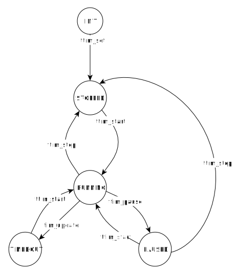

## **Introduction**

This library provides interfaces for create software timers within baremetal programming.

For running timers, the library it implements a list were the first element is the timer with the nearest timeo timeout value. That allows to process each tick interrupt with O(1) time complexity, for any number of running timers.

The each timer timeout event, the user can choose which interface to have with the application. If the user choose to use a polled arquitecture, it should use *ttim_is_timedout* function within the main superloop. If it chose using callbacks, the user should provide those callback funtions to *ttim_set* or *ttim_set_n_start* functions. Callbacks are called in ISR context.

## **State machine**
Each timer has the following state machine.  

## **API**

- **ttim_init**: Module initialization function.
- **ttim_ctor**: Object constructor. Only valid for configuration TTIM_MM_MODE==TTIM_MM_MODE_DYNAMIC
- **ttim_dtor**: Object desstructor. Only valid for configuration TTIM_MM_MODE==TTIM_MM_MODE_DYNAMIC

- **ttim_set**: Establish the time for a given timer. Also it configures its callback and parameter.
- **ttim_set_n_start**: Establish the time for a given timer and starts. Also it configures its callback and parameter.
- **ttim_start**: Starts the timer. If paused, it resumes the countdown from where it was left when called ttim_pause.
- **ttim_stop**: Stops the timer.
- **ttim_pause**: Pauses the timer.
- **ttim_reset_n_restart**: Resets the countdown, an restarts the timer.
- **ttim_is_timedout**: Returns if the timer is timedout.
- **ttim_is_stopped**: Returns if the timer is stopped.
- **ttim_get_remining_time**: Returns the remaining time for a started timer.
- **ttim_update**: Funcion that should be called within the hardware timer isr.

## **Library configuration**

The configuration is made by including in the project the file **tracker_config.h**.

* **TTIM_CB_MODE:** Callback Mode. It termines the mechanism that the module will use to communicate with the application.
    * **TTIM_CB_MODE_NONE:** No callbacks are used. The user should poll the timer status via *ttim_is_timedout*.

    * **TTIM_CB_MODE_SIMPLE:** The callback is called by passing just the timer id using this function prototype:
        `void <name>( TTIM_HND_T hnd );`

    * **TTIM_CB_MODE_PARAM:** The callback is called by passing the timer id that generated the call, and a user parameter using this function prototype:
        `void <name>( TTIM_HND_T hnd, void*param );`

* **TTIM_MM_MODE:** Memory Allocation Mode. It establish the memory allocation scheme for each timer.
    * **TTIM_MM_MODE_STATIC:** (DEFAULT)  In this mode the number of timers is fixed to TTIM_COUNT, and all the objects are allocated at compile time. All the timers are initialized with *ttim_init*.  The handlers for each timer are integer numbers starting from 0 to TTIM_COUNT-1.

   * **TTIM_MM_MODE_DYNAMIC:** In this mode dynamic memory is used for allocating timers at runtime. *ttim_init* should be called for initialize the module, but won't create any timers. The user should use ttim_ctor for creating a new timer that will return its handler.

* **TTIM_PERIODIC_TICK:** (DEFAULT = 0) It determines the algorithm for incrementing the partial timer counts. The user should call ttim_update() within a timer ISR. If 1, the isr will be fired in a regular basis.
If 0, the isr will be fired aperdiodically, based on the created timer dynamics.

* **Low level timebase configuration:** The user should provide configuration for all the low level timebase behavior. The confioguration is done by macros. **The user should have in mind that the hw timebase must have the desired range of timeouts needed**.

    * **TTIM_TIMEBASE_TYPE:** Defines the object data type that instances the timebase mechanism. If defined all the macros below, should have a first parameter that defines the global object. If not define, the timebase is driven directly by modifying peripheral's registers.
    * **TTIM_TIMEBASE_INIT(TIMER_HND):** Macro that should initialize the timebase hardware.
    * **TTIM_TIMEBASE_START(TIMER_HND,TIME):** Macro that should start the timebase for a fiven TIME period (measured in the same unit that every timeout for each ttim object).
    * **TTIM_TIMEBASE_STOP(TIMER_HND):** Macro that should stop the timebase.
    * **TTIM_TIMEBASE_ELAPSED(TIMER_HND):** Macro that should return the elapsed time since TTIM_TIMEBASE_START was called.
    * **TTIM_TIMEBASE_IS_RUNNING(TIMER_HND):** Macro that should return a positive number if the timebase is running or 0 if not.
    * **TTIM_TIMEBASE_IS_STOPPED(TIMER_HND):** Macro that should return a positive number if the timebase is stopped or 1 if not.

* System related configuration:
    * **TTIM_CRITICAL_START / TTIM_CRITICAL_END:** Macros to define critical sections within the library.
    * **TTIM_ASSERT(CONDITION):** Provides the library an assertion option. This is mostly used for debugging. In production releases, the false condition should reset the system.